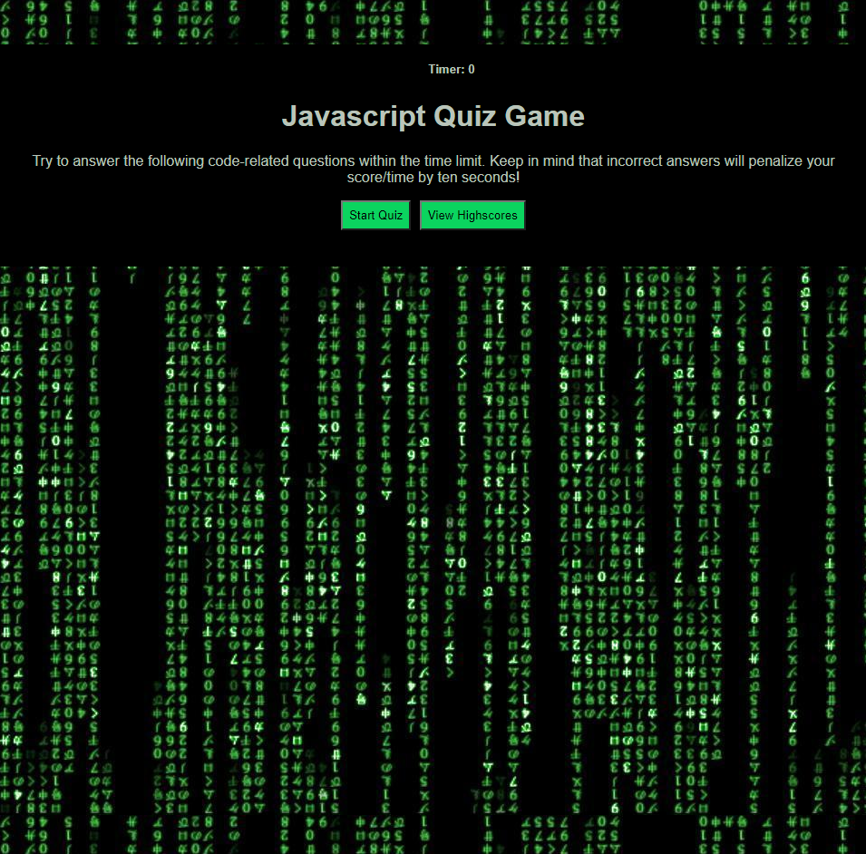

# js-quiz-game

This web application is designed as a responsive web game for the user to test their knowledge on JavaScript. The user races against the timer, which subtracts ten seconds for every incorrect answer. The user's high scores are recorded so the user can gauge their progress and play against their own best record.

## Table of Contents
* [Getting Started](#getting-started)
* [Main Page](#main-page)
* [Built With](#built-with)
* [Deployment](#deployment)
* [Next Steps](#next-steps)
* [Next Version of Application](#next-version-of-application)
* [Author](#author)

## Getting Started
There are no special instructions to get a copy of this project up and running on your local machine. Simply click on the deployed application link or copy and paste the url into your search bar to open in the browser of your choice.

## Main Page

## Built With
* HTML
* CSS
* Javascript

# Deployment
Deployed Application URL: https://jaymemizelle.github.io/js-quiz-game/

## Next Steps
* Refactor code for readability by consolidating all repeating code
* Add new functionality to high scores page to store more high scores

## Next Version of Application
### Coding Quiz Challenge
This is a complete refactor of this application in order to make the code more dry and efficient.
* Repository Link: https://github.com/jaymemizelle/coding-quiz-challenge
* Deployed Application URL: https://jaymemizelle.github.io/coding-quiz-challenge/

 ## Author
* Jayme Mizelle
